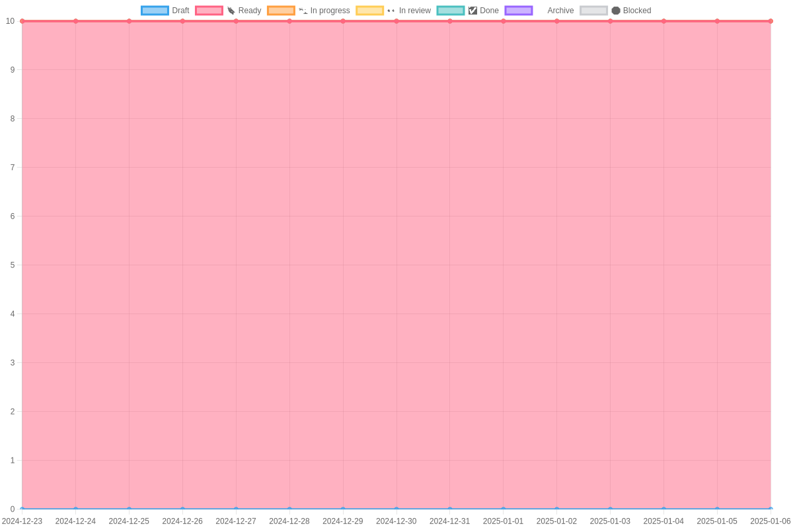

# Safe{Core} Sprint Stats

## Current Iteration: Iteration 33
### Status 2025-01-05

### Core Burn Down Chart

### Protocol Burn Down Chart

### SDK Burn Down Chart

### API Burn Down Chart

### DX Burn Down Chart

### Safenet Burn Down Chart

### Integrations Burn Down Chart

### Wallet Burn Down Chart

### Operations Burn Down Chart

### Platform Burn Down Chart

