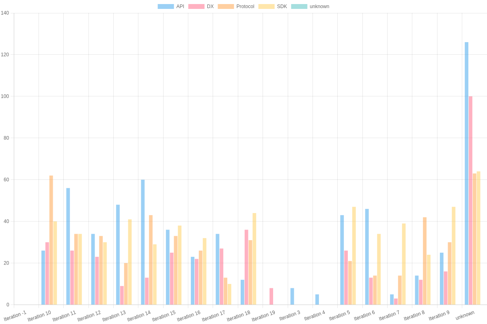
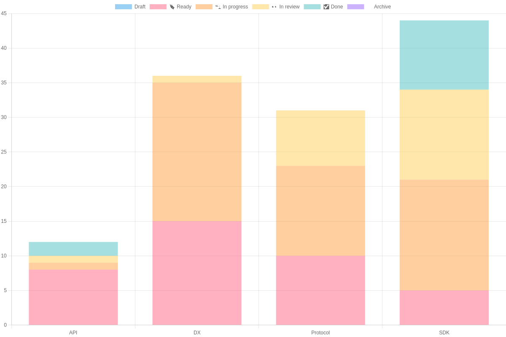
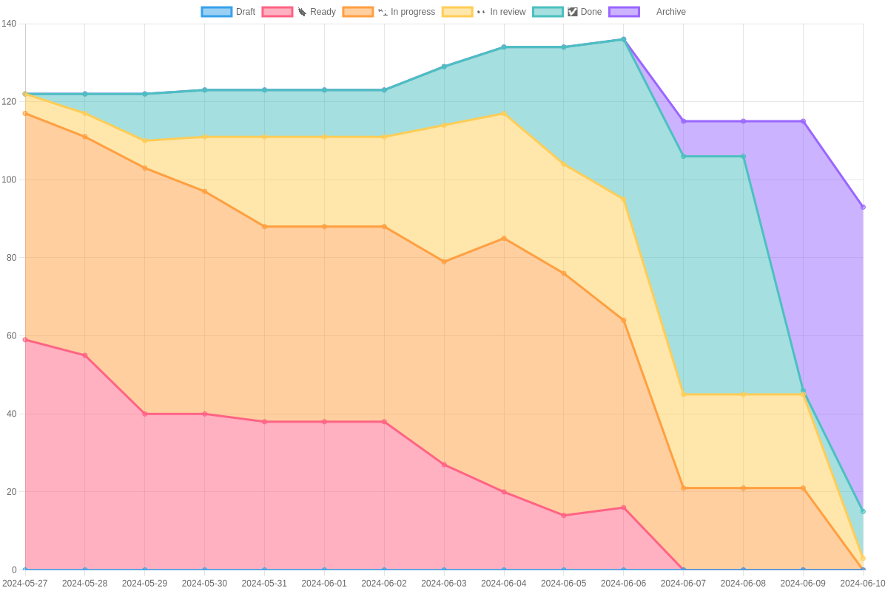
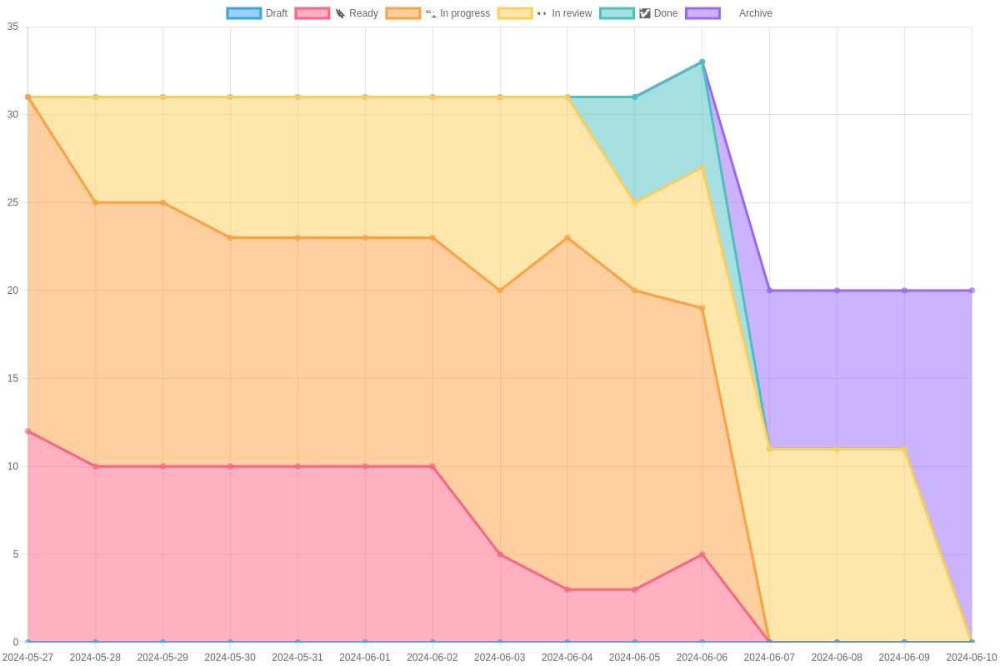
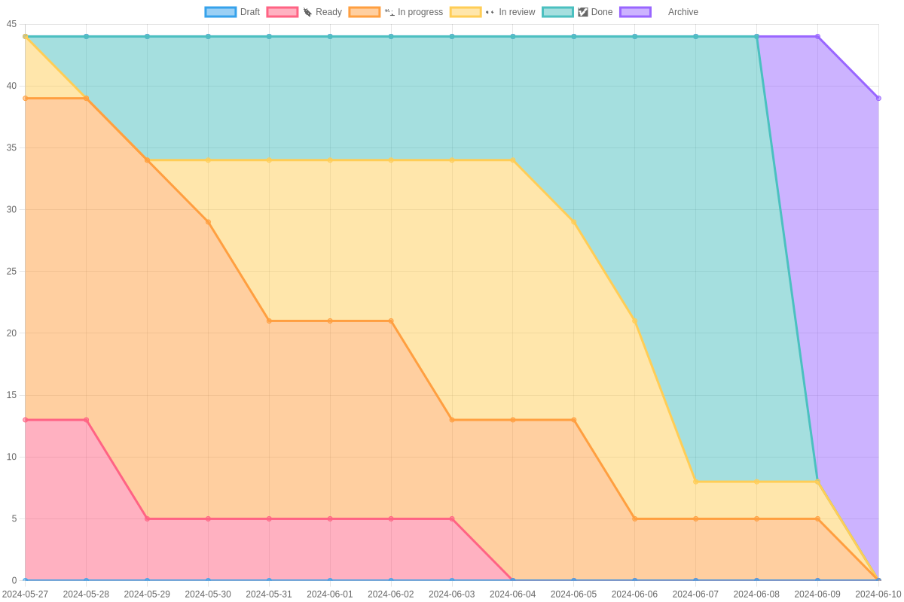
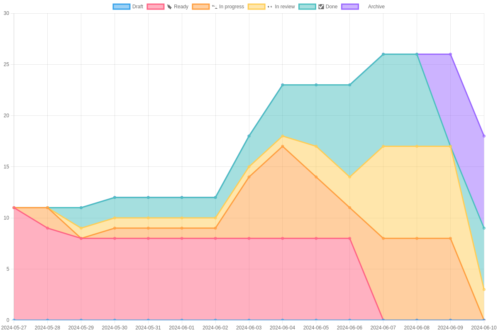
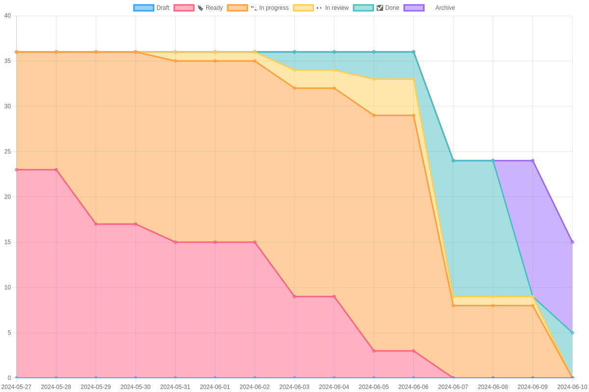

# Safe{Core} Sprint Stats

## Current Iteration: Iteration 18
### Status 2024-06-01

### Core Burn Down Chart

### Protocol Burn Down Chart

### SDK Burn Down Chart

### API Burn Down Chart

### DX Burn Down Chart

