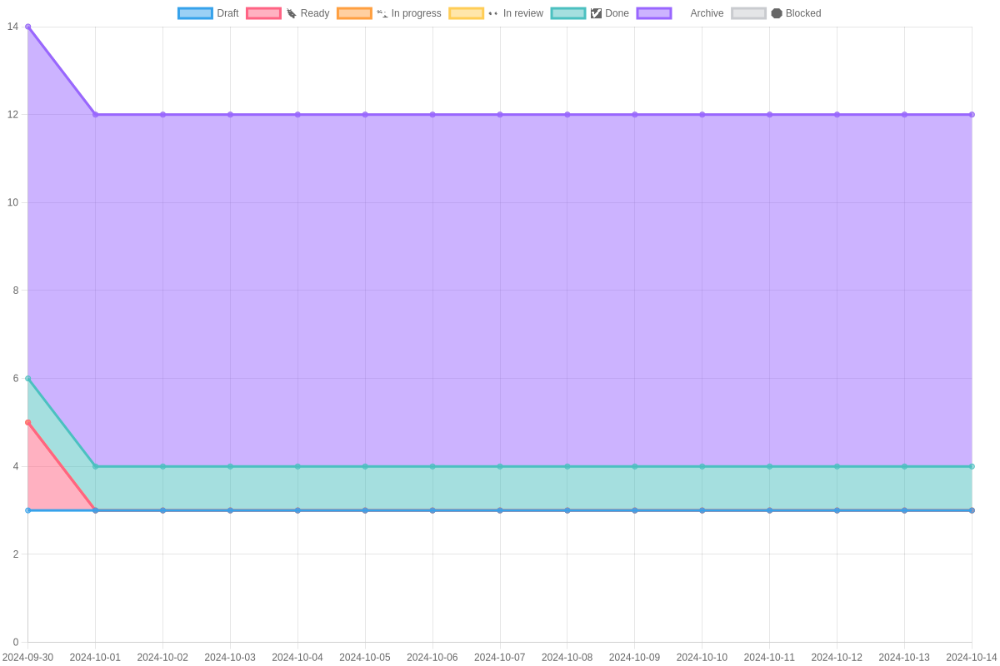
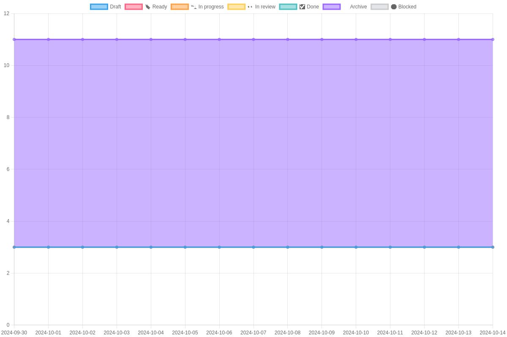
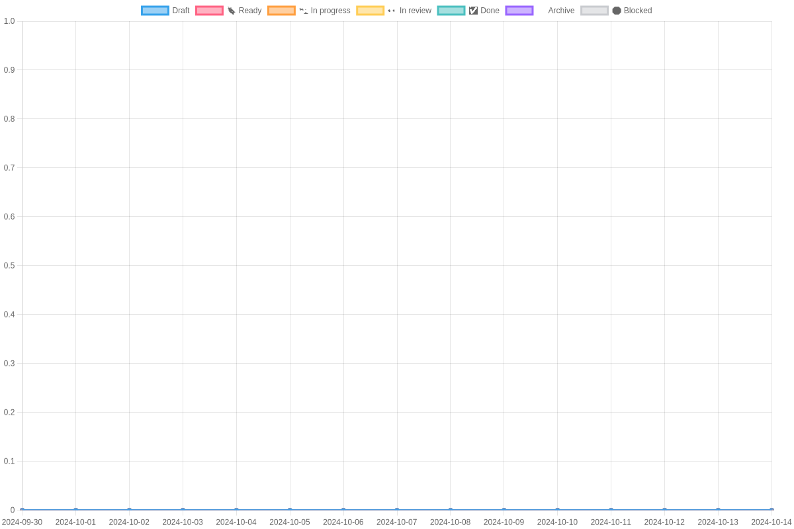
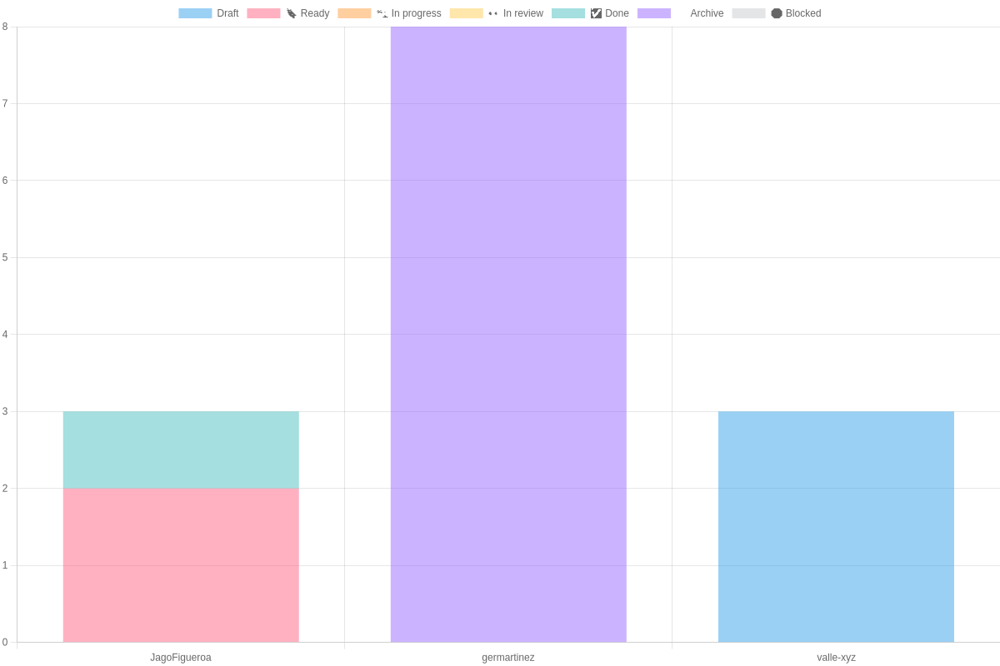

## Current Iteration: Iteration 27
### Last Status 2024-09-30

### Core Burn Down Chart

### Protocol Burn Down Chart

### SDK Burn Down Chart

### API Burn Down Chart

### DX Burn Down Chart

### Safenet Burn Down Chart

### Integrations Burn Down Chart

### Wallet Burn Down Chart

### Operations Burn Down Chart

### Platform Burn Down Chart

### Team member Status 2024-09-30

